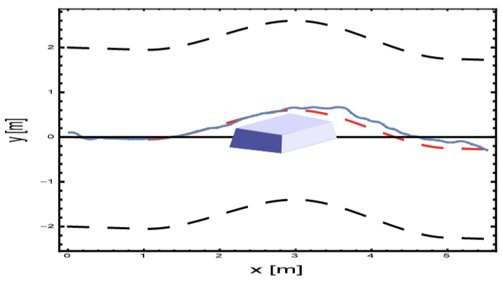

# ADS (Advanced Driving Simulator)

## Introduction

ADS is a simulator tool built in Mathematica for autonomous driving using complex mathematical modelling for lane-keeping and obstacle avoidance at evaluated at urban and highway driving scenarios

This package provides the implementation of our simulators and the generated results appearing in ["Vehicle Risk Assessment and Control for Lane-Keeping and Collision Avoidance at Low-Speed and High-Speed Scenarios"](https://ieeexplore.ieee.org/document/8295146) by Hazem Fahmy, Mohamed A. Abd El Ghany and Gerd Baumann.

This work is done as a part of the [Master's thesis](https://drive.google.com/file/d/0B6mUihC2zUIqYUZ4WngwRnN5dnc/view?resourcekey=0-5BH38huquyvV76-IN5W_Iw) of Hazem Fahmy 

## Project Description

This work examines a symbolic numerical approach to optimize a vehicle's track for autonomous driving and collision avoidance. The new approach uses the classical cost function definition incorporating the essential aspects of the dynamic state of the vehicle as position, orientation, time sampling, and constraints on slip angles of tires. The optimization processes minimize the cost function and simultaneously determine the optimal track by varying steering and breaking amplitudes. The current velocity of the vehicle is limited to a maximal velocity, thus, allowing a stable search of the optimal track. The parametric definition of obstacles generates a flexible environment for low and high speed simulations. The minimal number of influential optimization variables guarantees a stable and direct generation of optimal results. By the current new approach to control a vehicle on an optimal track, we are able to autonomously move the vehicle on an arbitrary track approximated by low order polynomials. The optimization approach is also able to deal with a variety of different obstacles and the corresponding optimal smooth obstacle path. The computations demonstrate the effective control of a four wheel vehicle in normal operation and exceptional obstacle avoidance with continuously differentiable obstacle avoidance tracks. Simulation tests are done using vehicles velocities of 3, 6, 7.6, 10, 12, and 18 m/s. At higher vehicles velocities, a mathematical-only approach is not sufficient and a mechanical intervention for tires is needed as a complimentary part to control the slip angle. The results shows that the cost function reached a considerably high average convergence-to-zero rate success in most of the tested scenarios.

## Results:

A tested scenario of a vehicle approaching a rough obstacle, ε = 0.5,on the road where the optimization and control algorithm succeeded to followthe ideal road and avoid the presented rough obstacle simultaneously:



## Reference:

If you use our work, please cite ADS in your publications. Here is an example BibTeX entry:
```
@ARTICLE{8295146,  
author={Fahmy, Hazem and Ghany, Mohamed A. Abd El and Baumann, Gerd},  
journal={IEEE Transactions on Vehicular Technology},   
title={Vehicle Risk Assessment and Control for Lane-Keeping and Collision Avoidance at Low-Speed and High-Speed Scenarios},   
year={2018},  
volume={67},  
number={6},  
pages={4806-4818},  
doi={10.1109/TVT.2018.2807796}
}
```
